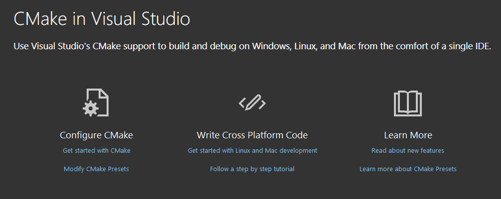

# LVGL for Visual Studio (CMake)

This is the LVGL simulator designed to run under Microsoft Visual Studio using CMake.

<figure style="text-align: center;">
    
    <figcaption>Screenshot 1: &nbsp;LVGL Widgets Demo</figcaption>
</figure>


## The Problem this Project Solves

The LVGL library has files that frequently:

- move,
- change names,
- new files are added, and
- old files are removed.

This type of directory-structure change typically happens a few times per month (observed in 2024-2025).

Given this behavior, the legacy Visual Studio `.vcxproj` file is not particularly appropriate for projects like this because it forces users of the project to have to "jump through hoops" to re-generate the `.vcxproj` file every time the directory structure of LVGL changes.  While this can be done programmatically, this is neither predictable nor intuitive, and thus such a requirement is found to be not being very user friendly.

This project solves that problem by incorporating Visual Studio's new-ish support for CMake.

If you ever get into trouble compiling, simply `Project > Configure lv_port_pc_visual_studio_cmake` or re-save the `LvglWindowsSimulator\CMakeLists.txt` file.  By default, Visual Studio initiates updating the CMake files automatically simply from the `CMakeLists.txt` file having a new timestamp.  If this is ever not enough, delete the entire contents of the project's `out/` directory (where CMake stores its files), forcing CMake to regenerate them from scratch, and the project will compile again.  Note:  you can do this from within Visual Studio by right-clicking the `out/` folder and selecting `Delete`.


## Cloning this Repository

To use this project, you will need to not only clone this repository, but also its submodules.  Do so in one step by:

```bash
git clone  --recurse-submodules  URL
```

Example:

```bash
git clone  --recurse-submodules  git@github.com:lvgl/lv_port_pc_visual_studio_cmake.git
```


 ## Opening Project for the First Time

It is strongly recommended to use Visual Studio 2026 or newer due to its improved integration with CMake.  If you do not already have it installed, you will also need to use Visual Studio Installer to install the "Desktop development with C++" workload tools, which brings CMake + Ninja integration into Visual Studio.

After carrying out the above steps above under **Cloning this Repository**, open it from Visual Studio by:

- `File > Open > Folder...` (not `Open Project/Solution...`  This is important!)
- Select `path\to\lv_port_pc_visual_studio_cmake\`
  - Recognizing it as a CMake project and taking initial set-up actions can take a 10-20 seconds depending on your system.  If properly recognized as a CMake project, you will see a project "splash screen" similar to Screenshot 2 below.
- If it is not already doing so, ensure Visual Studio is displaying the Solution Explorer in "Folder View".  If it isn't, right click any part of the Solution Explorer panel and select "Switch to Folder View".
- If Visual Studio does not automatically generate the needed CMake files, get it to do so by:
  
  - `Project > Configure lv_port_pc_visual_studio_cmake`
  
  Note:  this also applies whenever the project's directory structure changes in any way (new, removed, renamed or moved files).

Once this last step is completed, it is ready to build and run.

- `Build > Build All`
- `Debug > Start Debugging`


<figure style="text-align: center;">
    
    <figcaption>Screenshot 2: &nbsp;VS2026 Splash Screen for CMake Projects</figcaption>
</figure>


## Project Structure

The entry point for the program in this project is the `main()` function in `LvglWindowsSimulator.cpp`.

This project utilizes the LVGL library in the `lvgl/` directory.  Each subdirectory has its own `CMakeLists.txt` file which takes part in the generation of the Ninja build files, which Visual Studio then utilizes to build the project, instead of using the traditional `.vcxproj` project file.


## Changing the LVGL Example Demonstrated

By default, `LvglWindowsSimulator.cpp` runs the `lv_demo_widgets` example.  It does this by calling `lv_demo_widgets()`.  You will find the line which makes this call just above the `while(1)` loop at the end of the file.  To change which example is being run, simply comment out that line in `LvglWindowsSimulator.cpp` and add your own.  Example:

```cpp
// lv_demo_widgets();
lv_example_roller_1();
```

You can find the entire set of examples that LVGL ships with under `lvgl\examples\`, and the entire set of demos under `lvgl\demos\`.


## Updating LVGL

Periodically you will need or want to update the LVGL Git submodule to the current version or to a particular point in LVGL's version history.  Do so in the usual way.  **Caution:**  Visual Studio *does not* automatically detect file updates in the `lvgl\` directory structure.  You will need to tell Visual Studio to re-generate the CMake files by `Project > Configure lv_port_pc_visual_studio_cmake`, and to rebuild the application by `Build > Build All` or `Build > Rebuild` before running the application again with the updated content.


## Modifying Project Structure

**Caution:**  In this project you do not modify this Visual Studio project in the traditional way.  (If you try, as of early 2026, Visual Studio gets hopelessly confused.)  Instead you modify the project by modifying the appropriate `CMakeLists.txt` file(s).  If you need to add experimental files to the LVGL file structure, for instance, simply `Project > Configure lv_port_pc_visual_studio_cmake` or re-save the `LvglWindowsSimulator\CMakeLists.txt` file, and CMake will update its internal file list to include the `.c/.cpp` file(s) you added.  If this is not enough for any reason, delete the entire contents of the project's `out/` directory (where CMake stores its files), forcing CMake to regenerate them from scratch.  CMake takes care of adding the appropriate `*.c` and/or `*.cpp` file(s) that you added so that the project will thereafter use them.

If you need to add a top-level source file in the `LvglWindowsSimulator\` directory for any reason, just add it and then `Project > Configure lv_port_pc_visual_studio_cmake` and CMake will include your new source files (provided they end have extensions `.c`, `.cpp` or `.h`).  If you need it to add other extensions, simply add them to the `file(GLOB_RECURSE SOURCES...` CMake command in `LvglWindowsSimulator\CMakeLists.txt` following the same pattern already in place.  Visual Studio will respond according to its contents.

### Example:

Let's say you want to experiment with the example in `lv_example_roller_1.c`  without modifying the original file.

- From Visual Studio (or any editor), save that file to (for example) `my_roller_experiment.c` in the same directory as `lv_example_roller_1.c`.
- Rename the function from `lv_example_roller_1()` to `my_roller_experiment()`.
- In `lvgl\examples\widgets\lv_example_widgets.h`, add a prototype for your new function.
- `Project > Configure lv_port_pc_visual_studio_cmake` or re-save `LvglWindowsSimulator\CMakeLists.txt` to get CMake to update the generated CMake files in the `out\` directory.
- Build and run.

This works because `lvgl\env_support\cmake\os_desktop.cmake` (included by `lvgl\CMakeLists.txt`) contains several

```cmake
file(GLOB_RECURSE ...)
```

commands which automatically include:

- all `*.c` and `*.cpp` files contained in `lvgl\src\`,
- all `*.c` files contained in `lvgl\examples\`,
- etc.


## Further Reading

### CMake References

https://cmake.org/cmake/help/latest/

https://cmake.org/cmake/help/latest/manual/cmake.1.html

https://cmake.org/cmake/help/latest/manual/cmake-commands.7.html


### LVGL References

https://github.com/lvgl/lvgl

https://docs.lvgl.io/master/

