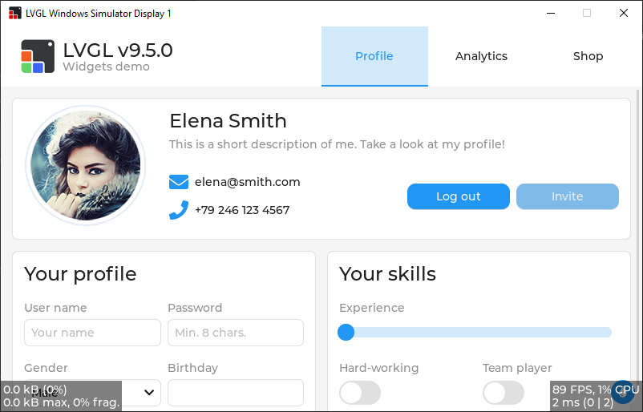

# LVGL for Visual Studio (CMake)

This is the LVGL simulator designed to run under Microsoft Visual Studio using CMake.




## The Problem this Project Solves

The LVGL library this project demonstrates has files that frequently:

- move,
- change names,
- new files are added, and
- old files are removed.

This type of directory-structure change typically happens a few times per month.

Given this behavior, the legacy Visual Studio `.vcxproj` file is not particularly appropriate for projects like this because it forces users of the project to have to "jump through hoops" to re-generate the `.vcxproj` file every time the directory structure of LVGL changes.  While this can be done programmatically, this is neither predictable nor intuitive, and thus such a requirement is deemed as not being very user friendly.

This project solves that probably by incorporating Visual Studio's new-ish support for CMake.

If you ever get into trouble compiling, simply delete the entire contents of the project's `out/` directory (where CMake stores its files), forcing CMake to regenerate them from scratch, and the project will just compile again.  Note:  you can do this from within Visual Studio by right-clicking the `out/` folder and selecting `Delete`.  Also, this regeneration (if it is minor) can also sometimes be done by simply saving the top-level `CMakeLists.txt` file—by default, Visual Studio initiates updating the CMake files simply from the `CMakeLists.txt` file having a new timestamp.


## Project Structure

The entry point for the program in this project is the `main()` function of `LvglWindowsSimulator.cpp`.

This project utilizes the LVGL library in the `lvgl/` directory, as well as the FreeType library in the `freetype/` directory used to generate fonts at run time.  Each has its own `CMakeLists.txt` file which takes part in the generation of the Ninja build files which Visual Studio then utilizes to build the project (instead of the traditional `.vcxproj` file).


### Changing the LVGL Example Demonstrated

By default, `LvglWindowsSimulator.cpp` runs the `lv_demo_widgets()` example.  You will find the line which makes this call just above the `while(1)` loop at the end of the file.  By default, `LvglWindowsSimulator.cpp` does this by calling `lv_demo_widgets()`.  To change which example is being run, simply comment out that line in `LvglWindowsSimulator.cpp` and add your own.  Example:

```cpp
lv_example_roller_1();
// lv_demo_widgets();
```


## Modifying the Project Structure

Caution:  you don't modify this Visual Studio project in the traditional way.  Instead you do so by modifying the appropriate `CMakeLists.txt` file.  If you need to add experimental files to the LVGL file structure, for instance, simply delete the entire contents of the project's `out/` directory (where CMake stores its files), forcing CMake to regenerate them from scratch, and the project will just compile:  CMake takes care of adding the appropriate `*.c` and/or `*.cpp` file(s) that you added so that the project will thereafter use them.


## Updating LVGL

Periodically you will want to update the LVGL Git submodule to the current version or to a particular point in LVGL's version history.  Do so in the usual way.  If LVGL's directory structure has changed, you will need to delete the entire contents of the project's `out/` directory (where CMake stores its files), forcing CMake to regenerate them from scratch, and the project will just compile again.
